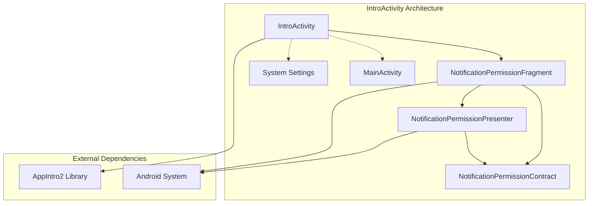
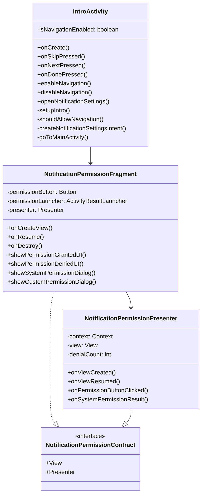
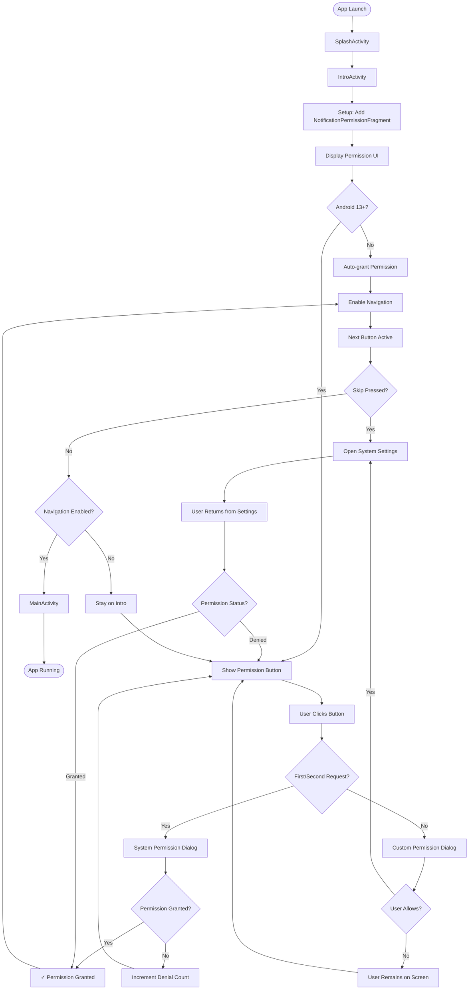
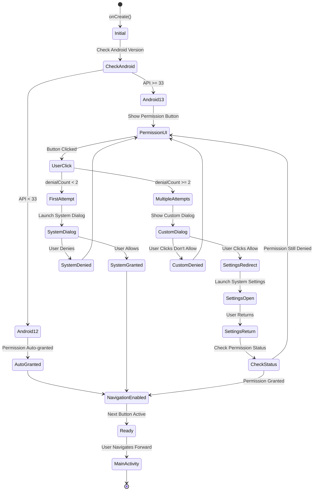
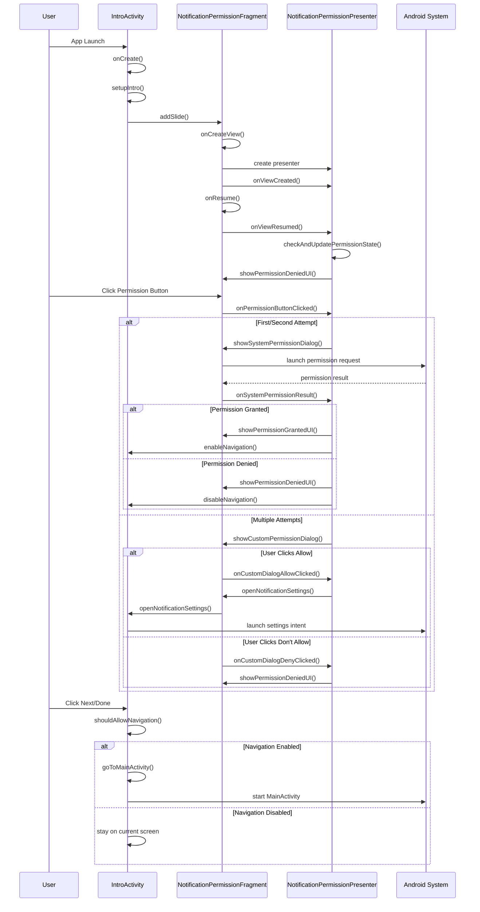
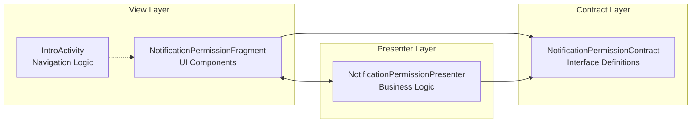
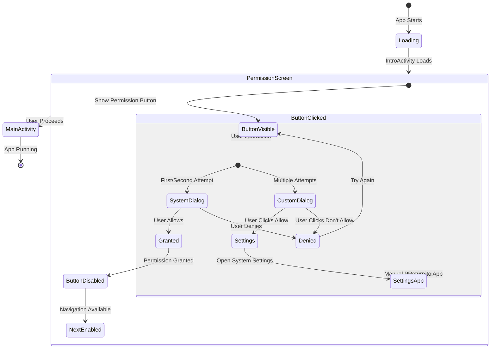

# IntroActivity Architecture Documentation

## 🏗️ Overview

The `IntroActivity` is a critical component in the LifeCycle app that implements a permission-gated onboarding flow using MVP (Model-View-Presenter) architecture. It ensures users grant notification permissions before accessing the main application.

## 📊 Architecture Diagram



## 🔄 Component Relationships



## 🚀 User Flow Diagram



## 🎯 Permission Handling Strategy



## 🔧 Method Interaction Flow



## 🏛️ MVP Architecture Benefits

### **Separation of Concerns**


### **Key Architecture Advantages**
1. **Testability**: Presenter can be unit tested independently
2. **Maintainability**: Clear separation of UI and business logic
3. **Reusability**: Presenter logic can be reused with different views
4. **Scalability**: Easy to add new features without affecting existing code

## 🎮 User Experience States



## 🔗 Integration Points

### **External Dependencies**
- **AppIntro2 Library**: Provides slide-based onboarding framework
- **Android Permission System**: Manages notification permission requests
- **System Settings**: Fallback for manual permission configuration

### **Internal Dependencies**
- **MainActivity**: Navigation destination after permission granted
- **SplashActivity**: Entry point that launches IntroActivity
- **String Resources**: Internationalized text content
- **Layout Resources**: UI definition for permission fragment

## 🛠️ Configuration & Customization

### **Android Manifest Configuration**
```xml
<activity
    android:name=".activity.IntroActivity"
    android:exported="false"
    android:theme="@style/Theme.LifeCycle.AppCompat" />
```

### **Key Configuration Points**
- **Theme**: AppCompat theme for consistent styling
- **Export**: False - internal navigation only
- **Fragments**: Single NotificationPermissionFragment slide
- **Permissions**: POST_NOTIFICATIONS for Android 13+

## 📱 Platform Compatibility

| Android Version | Behavior |
|----------------|----------|
| **API < 26 (Android 8.0)** | Auto-granted, settings fallback |
| **API 26-32 (Android 8.0-12)** | Auto-granted, enhanced settings |
| **API 33+ (Android 13+)** | Full permission flow with dialogs |

## 🧪 Testing Scenarios

### **Critical Test Cases**
1. **Permission Grant Flow**: User allows on first attempt
2. **Permission Denial Flow**: User denies multiple times
3. **Settings Integration**: Manual permission via system settings
4. **Version Compatibility**: Behavior across Android versions
5. **Navigation Control**: Next button state management
6. **Memory Management**: Proper presenter lifecycle

### **Edge Cases**
- App backgrounded during permission dialog
- System settings unavailable
- Permission revoked while app running
- Fragment recreation during configuration changes

---

## 📝 Summary

The IntroActivity implements a robust, user-friendly permission onboarding flow using modern Android architecture patterns. Its MVP design ensures maintainability and testability while providing a seamless user experience across different Android versions and permission states.

**Key Features:**
- ✅ MVP Architecture with clean separation
- ✅ Infinite permission retry capability  
- ✅ Graceful fallback to system settings
- ✅ Cross-platform compatibility
- ✅ Comprehensive error handling
- ✅ Navigation flow control

This architecture serves as a foundation for scalable Android app development with complex permission requirements.