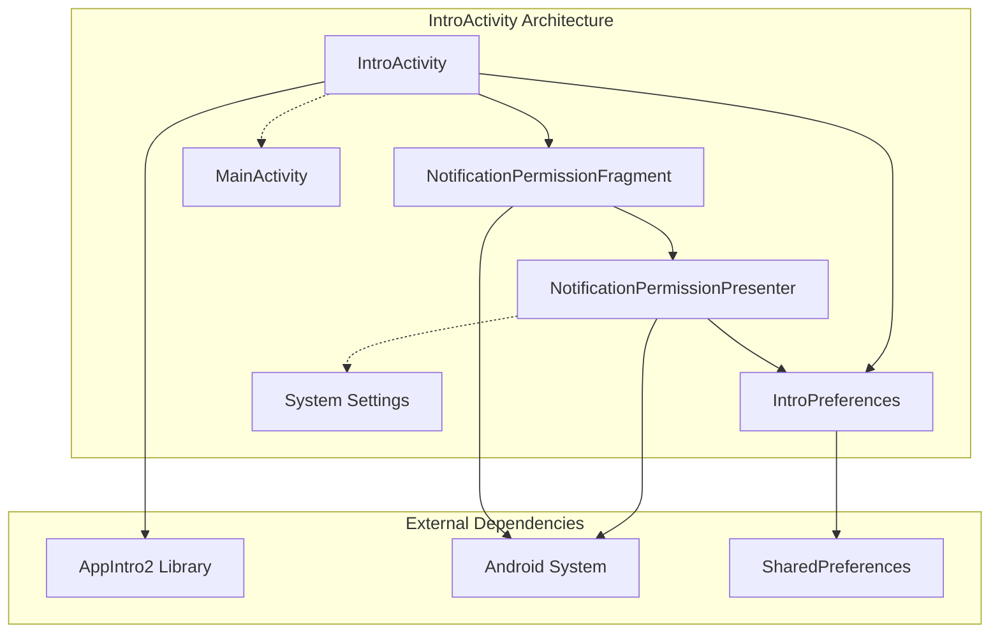
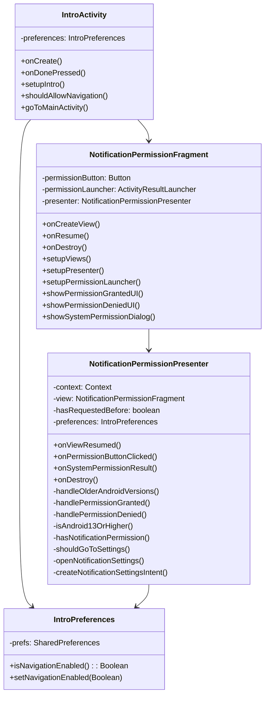
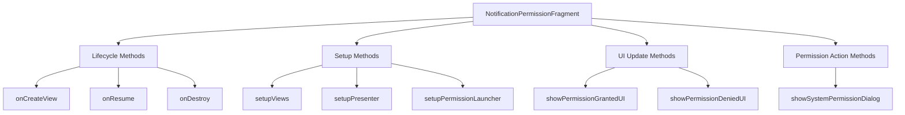
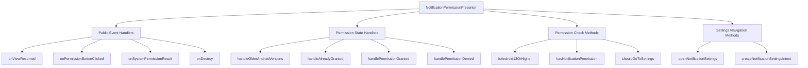
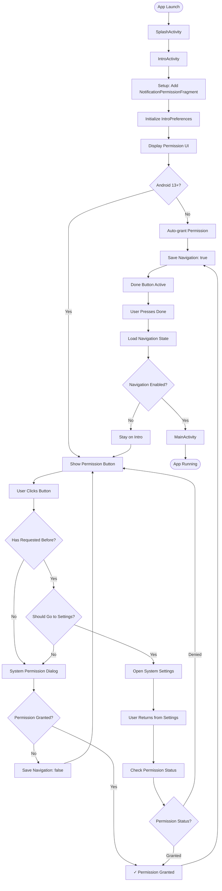
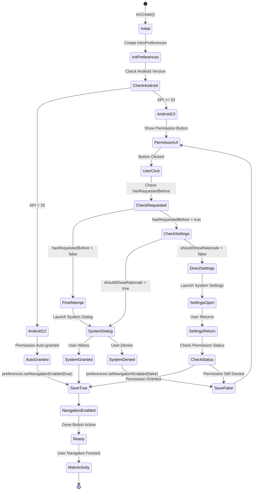
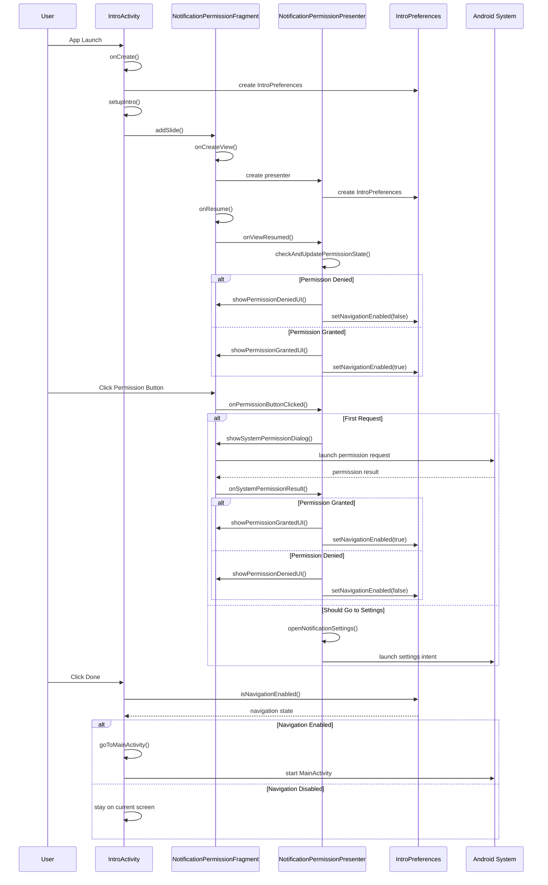
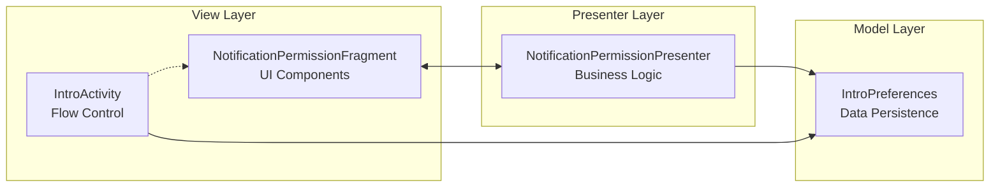
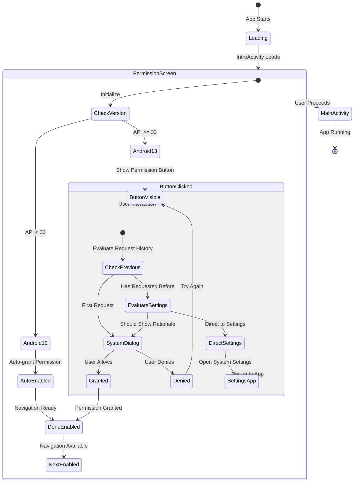

# IntroActivity Architecture Documentation

## 🏗️ Overview

The `IntroActivity` is a critical component in the LifeCycle app that implements a permission-gated onboarding flow using MVP (Model-View-Presenter) architecture with dedicated preference management. It ensures users grant notification permissions before accessing the main application.

## 📊 Updated Architecture Diagram

## 🔄 Updated Component Relationships

## 🏗️ Code Organization Structure

### **NotificationPermissionFragment Organization:**

### **NotificationPermissionPresenter Organization:**

## 🚀 Updated User Flow Diagram

## 🎯 Updated Permission Handling Strategy

## 🔧 Updated Method Interaction Flow

## 🏛️ Enhanced MVP Architecture Benefits

### **Improved Separation of Concerns**

### **Key Architecture Improvements**
1. **Dedicated Persistence Layer**: `IntroPreferences` encapsulates all SharedPreferences logic
2. **Simplified Dependencies**: Removed intermediate delegation methods
3. **Better Code Organization**: Functions grouped by responsibility with clear section headers
4. **Enhanced Testability**: Each component can be tested independently
5. **Improved Maintainability**: Clear separation between UI, business logic, and data persistence

## 🎮 Updated Permission States

## 🛠️ Implementation Details

### **IntroPreferences Class**
- **Purpose**: Centralized SharedPreferences management
- **Methods**: `isNavigationEnabled()`, `setNavigationEnabled(Boolean)`
- **Benefits**: Type-safe preference access, encapsulated storage logic

### **Presenter Architecture**
- **Business Logic**: All permission-related decisions in presenter
- **State Management**: Direct preference manipulation without delegation
- **Settings Navigation**: Self-contained settings intent creation and launch

### **Fragment Simplification**
- **UI Focus**: Pure UI component without business logic
- **Method Organization**: Grouped by functionality (Lifecycle, Setup, UI Updates, Actions)
- **Clean Interface**: Clear public methods for presenter communication

## 📱 Updated Platform Compatibility

| Android Version | Behavior | Implementation |
|----------------|----------|----------------|
| **API < 26** | Auto-granted, settings fallback | `handleOlderAndroidVersions()` |
| **API 26-32** | Auto-granted, enhanced settings | `handleOlderAndroidVersions()` |
| **API 33+** | Full permission flow | `shouldGoToSettings()` logic |

## 🧪 Updated Testing Scenarios

### **Critical Test Cases**
1. **IntroPreferences**: Data persistence and retrieval
2. **Permission Flow**: First request vs. subsequent requests
3. **Settings Integration**: Direct navigation to system settings
4. **Version Compatibility**: Behavior across Android versions
5. **State Management**: Navigation state persistence across app sessions
6. **Code Organization**: Method grouping and flow clarity

### **New Test Considerations**
- **Preference Isolation**: Test IntroPreferences independently
- **Presenter Logic**: Test business logic without UI dependencies
- **Flow Organization**: Verify method grouping doesn't affect functionality

---

## 📝 Summary

The updated IntroActivity architecture represents a significant improvement in code organization and separation of concerns. The introduction of `IntroPreferences` creates a dedicated data layer, while the reorganized Fragment and Presenter provide clearer code structure and better maintainability.

**Key Architectural Improvements:**
- ✅ Dedicated preference management with `IntroPreferences`
- ✅ Simplified permission flow with `shouldGoToSettings()` logic
- ✅ Organized code structure with functional grouping
- ✅ Reduced coupling between components
- ✅ Enhanced testability with clear separation of concerns
- ✅ Improved maintainability with logical method organization

**Updated Code Organization:**
- 📁 **Fragment**: Lifecycle → Setup → UI Updates → Actions
- 📁 **Presenter**: Event Handlers → State Handlers → Checks → Settings
- 📁 **Preferences**: Centralized data persistence management

This refined architecture serves as an excellent foundation for scalable Android app development with complex permission requirements and demonstrates best practices in MVP pattern implementation.